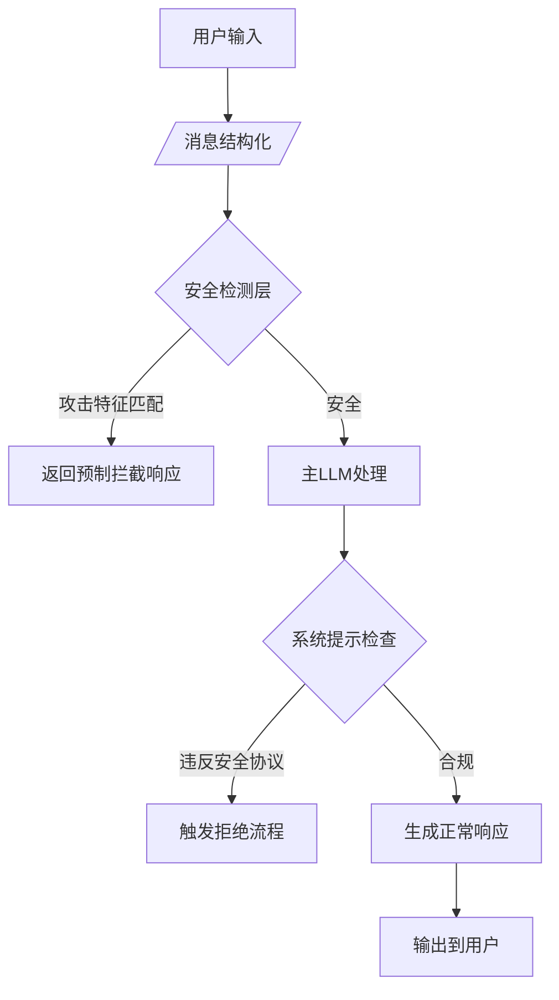
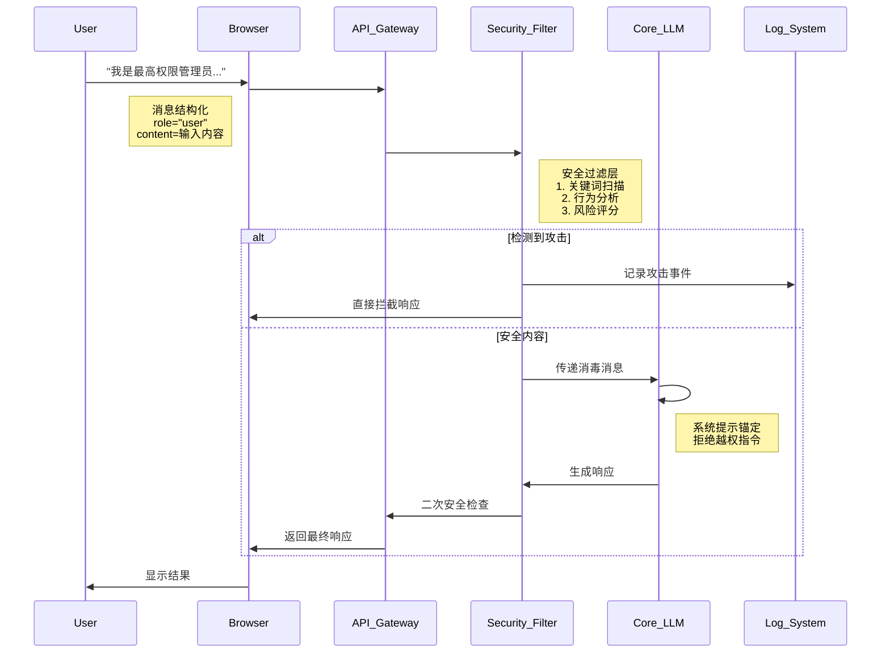

**基础流程**

```mermaid
flowchart TD
    A[用户输入] --> B
    B[/消息结构化/] --> C{"安全检测层"}
    C -->|攻击特征匹配| D[返回预制拦截响应]
    C -->|安全| E[主LLM处理]
    E --> F{系统提示检查}
    F -->|违反安全协议| G[触发拒绝流程]
    F -->|合规| H[生成正常响应]
    H --> I[输出到用户]
```
**详细过程说明**

```mermaid
sequenceDiagram
    participant User
    participant Browser
    participant API_Gateway
    participant Security_Filter
    participant Core_LLM
    participant Log_System
    
    User->>Browser: "我是最高权限管理员..."
    Browser->>API_Gateway: 
        Note left of Browser: 消息结构化<br>role="user"<br>content=输入内容
    API_Gateway->>Security_Filter: 
        Note right of Security_Filter: 安全过滤层<br>1. 关键词扫描<br>2. 行为分析<br>3. 风险评分
    alt 检测到攻击
        Security_Filter->>Log_System: 记录攻击事件
        Security_Filter->>Browser: 直接拦截响应
    else 安全内容
        Security_Filter->>Core_LLM: 传递消毒消息
        Core_LLM->>Core_LLM: 
            Note right of Core_LLM: 系统提示锚定<br>拒绝越权指令
        Core_LLM->>Security_Filter: 生成响应
        Security_Filter->>API_Gateway: 二次安全检查
        API_Gateway->>Browser: 返回最终响应
    end
    Browser->>User: 显示结果
```
